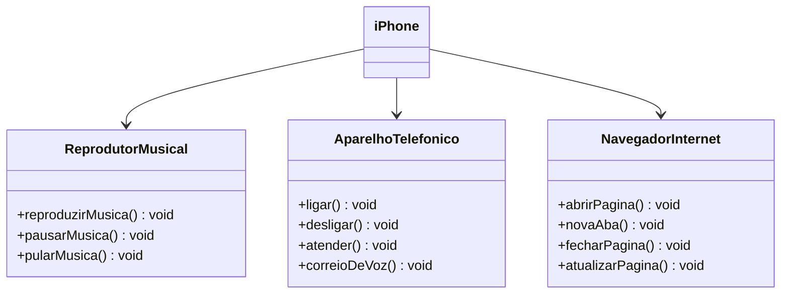

# UML iPhone

```mermaid
    classDiagram
    class ReprodutorMusical {
      +reproduzirMusica() void
      +pausarMusica() void
      +pularMusica() void
    }

    class AparelhoTelefonico {
      +ligar() void
      +desligar() void
      +atender() void
      +correioDeVoz() void
      }
  
    class NavegadorInternet {
      +abrirPagina() void
      +novaAba() void
      +fecharPagina() void
      +atualizarPagina() void
      }
  
    class iPhone {
      }
  
    iPhone --> ReprodutorMusical
    iPhone --> AparelhoTelefonico
    iPhone --> NavegadorInternet
```
