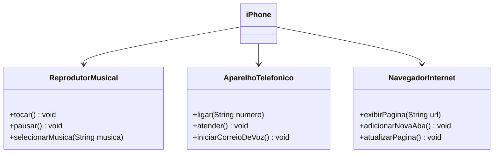

# UML iPhone

```mermaid
    classDiagram
    class ReprodutorMusical {
      +tocar() void
      +pausar() void
      +selecionarMusica(String musica) 
    }

    class AparelhoTelefonico {
      +ligar(String numero)
      +atender() void
      +iniciarCorreioDeVoz() void
      }
  
    class NavegadorInternet {
      +exibirPagina(String url)
      +adicionarNovaAba() void
      +atualizarPagina() void
      }
  
    class iPhone {
      }
  
    iPhone --> ReprodutorMusical
    iPhone --> AparelhoTelefonico
    iPhone --> NavegadorInternet
```
